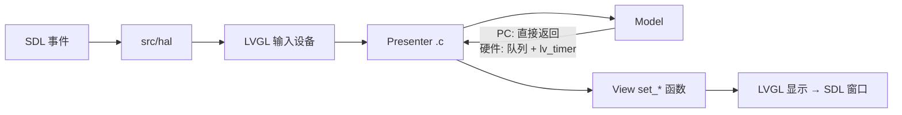

# 架构

> 基线文档：描述系统**当前**的结构与关键决策。由 `handoff` 阶段按需更新（模块、依赖、数据流、技术选型发生变化时）。

## 技术栈

| 层 | 选型 | 版本 | 理由 |
| --- | --- | --- | --- |
| 语言 | C99 | — | LVGL 与嵌入式目标的共同基线；头文件对 C++ 用 `extern "C"` 暴露 |
| GUI 库 | LVGL（`lvgl/` submodule） | 跟随 submodule 的 gitlink | 目标硬件即用 LVGL，模拟器与硬件共用同一份 UI 代码 |
| 窗口/输入 | SDL2（vcpkg 提供） | vcpkg 当前版本 | LVGL 官方支持的 PC 后端，跨 Windows/macOS |
| 构建系统 | CMake | ≥ 3.12.4 | LVGL 与 vcpkg 的原生集成方式 |
| 依赖管理 | vcpkg（同级目录 `../vcpkg`） | — | 避免机器相关绝对路径；Windows 可产出静态链接可执行文件 |
| 可选内核 | FreeRTOS（`FreeRTOS/` submodule） | 跟随 gitlink | `USE_FREERTOS=ON` 时验证 LVGL 的 RTOS 调度路径 |
| 资源转换 | Python 3 + Pillow | — | 仅在重新生成 Hair Dryer 图片资源时需要 |

## 模块结构

| 模块 | 路径 | 职责 | 依赖 |
| --- | --- | --- | --- |
| SDL HAL | `src/hal/hal.c`、`hal.h` | 创建 SDL 显示、鼠标/滚轮/键盘输入设备、LVGL tick | LVGL、SDL2 |
| 宿主入口 | `src/main.c` | 选择项目头文件、解析屏幕尺寸宏、初始化 HAL 与模块、跑 LVGL 循环 | HAL、被选中的模块 |
| FreeRTOS 入口 | `src/freertos_main.c` | `USE_FREERTOS=ON` 时的独立演示路径（**不初始化**被选中的模块） | FreeRTOS、LVGL |
| 应用模块 | `projects/<name>/inc`、`src` | 单个产品的 MVP 三层实现，只暴露 `<name>_ui_init()` 与数据推送 API | LVGL |
| 构建脚本 | `build.*`、`run.*`、`clean.*` | 项目/配置参数解析、triplet 选择、输出目录隔离 | CMake、vcpkg |
| 配置 | `lv_conf.h`、`lv_conf.defaults`、`config/FreeRTOSConfig.h` | LVGL 与 FreeRTOS 编译期配置 | — |

模块内部强制 MVP 分层：

| 层 | 文件 | 拥有 |
| --- | --- | --- |
| Model | `<project>_model.c/.h` | 数据、状态、硬件 I/O（硬件调用包在 `#ifndef LV_SIMULATOR` 内） |
| View | `<project>_view.c/.h` | 全部 `lv_obj_create` 与样式，暴露 `<project>_view_set_*()`，不持有业务状态 |
| Presenter | `<project>.c` | 注册 LVGL 事件回调，串联 Model 与 View，不直接持有 LVGL 对象 |

## 关键数据流

跨线程约束：硬件 Model 任务通过 `static QueueHandle_t s_<name>_queue` 传值型结构体，**只**在 LVGL 线程的 `lv_timer_t` 回调里消费；任何 `lv_obj_*` 调用都不得出现在 FreeRTOS 任务上下文。

## 架构决策记录

| # | 决策 | 日期 | 备选与否决理由 | 来源功能 |
| --- | --- | --- | --- | --- |
| ADR-1 | 应用模块作为 Git submodule 独立版本管理 | 存量 | 备选：单仓库多目录。否决：各产品发布节奏与权限不同 | 存量 |
| ADR-2 | 屏幕尺寸只由模块公开头文件定义，`src/main.c` 适配宏名并兜底 320 x 480 | 存量 | 备选：CMake `add_compile_definitions`。否决：尺寸属于模块契约，CMake 定义会造成两处真相 | 存量 |
| ADR-3 | vcpkg 只从 `${CMAKE_SOURCE_DIR}/../vcpkg` 解析 | 存量 | 备选：绝对路径 / 环境变量。否决：绝对路径不可移植 | 存量 |
| ADR-4 | 默认静态 triplet（Windows `x64-windows-static`，macOS 按架构自动选 `arm64-osx` / `x64-osx`） | 存量 | 备选：动态 triplet。否决：分发时需随包拷贝 DLL | 存量 |
| ADR-5 | 构建与产物按 `<配置>/<项目>` 隔离 | 存量 | 备选：共享 build 目录。否决：CMake 缓存会锁定首次配置的 triplet 与项目 | 存量 |
| ADR-6 | 硬件专属代码一律包在 `#ifndef LV_SIMULATOR` 内 | 存量 | 备选：分叉源码。否决：同一份 UI 代码要同时服务模拟器与硬件 | 存量 |
| ADR-7 | 模块统一 MVP 分层，View 不直接读 Model | 存量 | 备选：UI 与逻辑混写。否决：硬件替换时需要只换 Model | 存量 |

## 已知技术债

| 位置 | 简化点（`ponytail:` 标记） | 上限 | 升级路径 |
| --- | --- | --- | --- |
| `src/freertos_main.c` | `USE_FREERTOS=ON` 只跑独立演示，不初始化被选中的模块 | 无法用 RTOS 路径验证真实项目 | 让 FreeRTOS 入口复用 `main.c` 的项目分派逻辑 |
| `src/main.c` | 项目选择、头文件包含、尺寸宏适配全部靠 `#if defined(PROJECT_*)` 手写分支 | 每加一个项目要改 8 处清单（CMake、6 个脚本、main.c、文档） | 模块注册表或 CMake 生成的分派头文件 |
| 模块公开 API | 各模块只有 `*_ui_init()`，没有反初始化 API | UI 初始化是一次性的，静态 LVGL 对象/定时器无法释放 | 需要多实例时补 `*_ui_deinit()` |
| 全仓 | 无自动化测试，验证依赖构建成功 + 手动操作 | 回归只能靠人眼 | 见 [acceptance-criteria.md](acceptance-criteria.md) 回归集的待建立项 |
