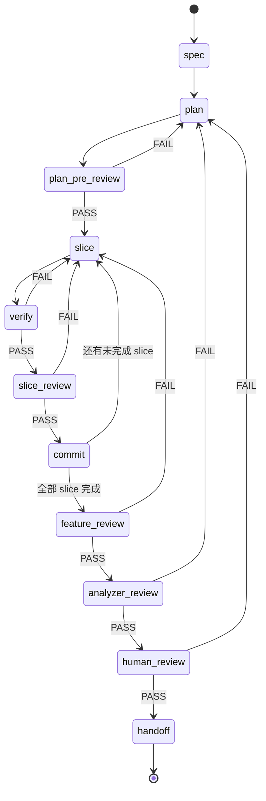

# 三 Agent 协作工作流

> **本文件是给人类读的总览，agent 不读它。**
> 机器执行的真相源是 `.github/agents/*.agent.md`（各 agent 的完整行为定义，自包含）与 `.github/prompts/pz-*.prompt.md`（各入口的编排逻辑与类型特化）。两边不一致时**以 `.github/` 下的文件为准**，本文件是它们的人类可读镜像，可能滞后。
>
> 改流程的顺序：先改 `.github/` 下对应文件 → 再回来同步本文件。只改这里等于没改。

**入口 prompt**：

| Prompt | 用途 |
| --- | --- |
| `/pz-init` | 项目冷启动，访谈式填充四份基线文档 |
| `/pz-feature-workflow` `/pz-ui-workflow` `/pz-bugfix-workflow` `/pz-refactor-workflow` | 四类工作的入口，各自有类型特化的 spec 门禁与验证要求 |
| `/pz-continue` | 从中断处恢复任意进行中的工作 |
| `/pz-human-review` | 人工评审阶段 |
| `/pz-handoff` | 收尾归档 |
| `/pz-status` | 只读进度看板 |
| `/pz-retro` | 压缩 experience，把反复出现的教训升级为流程规则 |
| `/pz-quick-fix` | 无行为变化的小改动快速通道（唯一合法的绕过通道） |
| `/pz-modify-harness` | 修改工作流本身（agents / prompts / 流程文档），按交叉引用清单一次改齐 |

本文件描述的是**四类工作共用的状态机**；类型特化（额外必填字段、验证方式、红线）写在各入口 prompt 里。

## 1. 角色分工

| 角色 | 负责阶段 | 权限边界 |
| --- | --- | --- |
| `analyzer` | `spec`、`plan`、`analyzer-review`、`handoff` | 只写 `docs/**`；git 只读，任何 git 写操作委派 `executor` |
| `executor` | `slice`、`verify`、`commit`（含 handoff 的 squash） | 写源码与测试；写 `docs/work/<feature-id>/plan.md` 的状态列 |
| `reviewer` | `plan-pre-review`、`slice-review`、`feature-review` | 只读源码；只写 `scorecards.md` 与自己的 experience |
| `explorer` | `plan` 阶段的**条件子调用**（不是独立阶段） | 只写 `plan.md` 的「外部依赖调研」一节与自己的 experience；**无 `execute` 权限**，不装包、不跑外部代码，需要执行时委派 `executor` |

编排者（orchestrator）是运行 prompt 的主 agent，负责按状态机推进、调度 agent、维护 Run State。Agent 之间只在需要对方**专属权限**时直接互调（例：`analyzer` 需要 git 写 → 调 `executor`；`explorer` 需要执行命令 → 调 `executor`），评审回路一律由编排者驱动。

## 2. 状态机



阶段标识符（写入 Run State 时使用）：
`spec` → `plan` → `plan-pre-review` → (`slice` → `verify` → `slice-review` → `commit`)\* → `feature-review` → `analyzer-review` → `human-review` → `handoff` → `done`

## 3. 各阶段定义

> **评审阶段的 skill 不写死。** `plan-pre-review` / `slice-review` / `feature-review` / `analyzer-review` / `handoff` 用哪些 skill（`ponytail-review`、`verification-before-completion`、`systematic-debugging` 等）由 `reviewer` / `analyzer` 在**运行时根据评审对象自己判断**，候选表分别写在 [reviewer.agent.md](../.github/agents/reviewer.agent.md) 和 [analyzer.agent.md](../.github/agents/analyzer.agent.md)。原则：先看 description 再决定是否读全文、单次最多 2 个、选用与不选用都写一行理由。

### 3.1 spec（analyzer）

1. 要求用户按 [docs/spec.md](spec.md) 的模板提供 spec；缺项必须逐条追问，**不允许替用户猜**。
2. 强制加载 `brainstorming` skill 澄清意图与边界。
3. 读 [docs/archive/knowledge/index.md](archive/knowledge/index.md) 的关键词表，**只在命中关键词时**再读对应知识文件全文。
4. 读 `docs/archive/experience/analyzer/lessons.md`。
5. 根据 spec 内容判断还需要哪些 skill（判断依据写进产出物的「Skill 选用」小节，含选用与**显式排除**的理由）：

   | 触发信号 | 建议 skill |
   | --- | --- |
   | LVGL 界面 / 视觉 / 交互 | 无专用 skill：按 `/pz-ui-workflow` 的状态矩阵与输入映射门禁走 |
   | 明确的 bug / 异常行为 | `systematic-debugging` |
   | 有可测行为的功能 | `test-driven-development` |
   | 多步骤实现 | `writing-plans`、`executing-plans` |
   | 独立子任务 ≥ 2 | `dispatching-parallel-agents` |
   | 文档 / 规范类产出 | `doc-coauthoring` |
   | 复杂度存疑、担心过度设计 | `ponytail` / `ponytail-review` |

6. 产出 `docs/work/<feature-id>/spec.md`（用户输入 + 澄清结论 + 输入输出契约 + Skill 选用）。
7. **门禁**：输入契约、输出契约、验收标准三者齐全且无 `TBD`，否则不得进入 `plan`。

### 3.2 plan（analyzer）

产出 `docs/work/<feature-id>/plan.md`，必须包含：

- `## Run State`（见 §5）
- `## 方案`：选定方案 + 被否决的方案及否决理由（体现「先复用再新建」的取舍）
- `## 影响面`：涉及文件、外部依赖、数据/接口变更、风险
- `## Slices`：切片表（见 §5），每片必须**可独立验证、可独立提交**
- `## 不做的事`：显式 out-of-scope

切片粒度要求：一片一个可验证行为，改动文件数尽量 ≤ 5；跨 3 个以上模块的片必须再拆。

#### 何时调 `explorer`

`analyzer` **同时满足**下列三条才调 `explorer`，否则不调（绝大多数 plan 不该调）：

1. 需要一个当前代码库不具备的能力；
2. 已逐级爬过懒惰阶梯（复用既有 → 标准库 → 平台原生 → 已装依赖）并**逐级写出为什么不行**；
3. 自己写的成本明显不划算（不是「写起来有点烦」，而是「要写数百行且有正确性风险」，例如时区、加密、解析器、国际化）。

需求交给 `explorer` 时必须描述为**能力**而非库名。`explorer` 产出写入 `plan.md` 的 `## 外部依赖调研` 一节（模板见 [explorer.agent.md](../.github/agents/explorer.agent.md)），包含阶梯排除、三道关（纸面尽调 / 源码审核 / spike 验证）、项目匹配度六维、退出成本。

`explorer` **只出报告不做决定**，其默认结论是「不引入」；是否采纳由 `analyzer` 写进方案，并经 `plan-pre-review` 与人类把关。spike 验证涉及安装依赖（= 执行任意代码），**必须经人类批准后由 `executor` 在隔离目录执行**。

### 3.3 plan-pre-review（reviewer）

按 [scorecard 模板](archive/experience/scorecard.md) 评审 plan，重点：方案是否过度设计、切片是否可独立验证、影响面是否漏项、验收标准是否可执行。

**新依赖检查**（plan 引入了任何新的第三方依赖时必查）：

- plan 包含新依赖却**没有** `## 外部依赖调研` 一节 → 直接 **FAIL**。
- 调研节缺阶梯排除、缺「不引入，自己写」候选、缺退出成本估计 → **FAIL**。
- **抽查一条关 2 源码审核结论**：自己去看那个文件那几行，对不上 → D3 记 0-1 分并 **FAIL**（同「复跑 executor 声称跑过的命令」）。
- 命中红旗却被判为「可接受」且理由不充分 → **FAIL**。

- **PASS** → 进入 `slice`
- **FAIL** → 追加 experience 到 `docs/archive/experience/reviewer/lessons.md`，把「必须修复项」交回 `analyzer`；`analyzer` 修正 plan 的同时追加 experience 到 `docs/archive/experience/analyzer/lessons.md`，然后重跑 `plan-pre-review`

### 3.4 slice（executor）

取 `plan.md` 中第一个状态为 `todo` / `rework` 的切片，读 `docs/archive/experience/executor/lessons.md` 后实现。只做该切片范围内的改动，不夹带重构。

### 3.5 verify（executor）

执行切片声明的验证命令（测试 / 构建 / lint / 运行时检查），把**真实命令与真实输出摘要**写进 `plan.md` 的切片行。禁止在未跑命令的情况下声称通过；失败则回到 `slice` 修复。

### 3.6 slice-review（reviewer）

只读地评审该切片的 diff 与验证证据，产出 scorecard。

- **PASS** → 进入 `commit`
- **FAIL** → reviewer 追加 experience；`executor` 追加 experience 并把该切片状态置为 `rework`，重做 `slice`

### 3.7 commit（executor）

提交该切片，提交信息格式：`<type>(<feature-id>): <slice-id> <一句话>`（`type` ∈ feat/fix/docs/refactor/test/chore）。一个切片一个 commit。提交后更新切片状态为 `committed`。若还有未完成切片，回到 `slice`；否则进入 `feature-review`。

### 3.8 feature-review（reviewer）

对整个功能（所有切片合并后的效果）评审：spec 覆盖度、切片间的集成问题、回归风险、是否有跨切片的重复或死代码。

- **PASS** → 进入 `analyzer-review`
- **FAIL** → 同 §3.6 的失败处理；由 `analyzer` 判定是回到 `slice`（实现问题）还是回到 `plan`（计划缺陷）

### 3.9 analyzer-review（analyzer）

`analyzer` 站在提出者立场做最终自检：实现是否真正解决了 spec 里的问题、是否偏离原始意图、理解差异是否被消解、是否引入了 spec 之外的东西。产出 scorecard。

- **PASS** → 进入 `human-review`
- **FAIL** → 追加 experience，回退到 `plan` 或 `slice`（由 analyzer 指定）

### 3.10 human-review（人类）

编排者在 chat 中**完整贴出** [scorecard 模板](archive/experience/scorecard.md)，附上本次功能的变更摘要、验证证据、已知风险，交由人类填写。人类回复后：

- **PASS** → 进入 `handoff`
- **FAIL** → 编排者把人类填写的 scorecard 存档，按人类指出的问题分派给对应角色，各角色追加 experience，回退到指定阶段

人类未回复前，工作流**必须停住**，不得自行判定通过。

### 3.11 handoff（analyzer，git 操作委派 executor）

1. 生成 `docs/archive/handoff/handoff-<feature-id>.md`（模板见 §6）。
2. 委派 `executor` 把本次功能的所有 commit squash 成一个 commit，信息格式：`feat(<feature-id>): <一句话摘要>`。squash 前必须确认工作区干净、目标 commit 范围正确；**squash 属于历史重写，执行前需人类确认**。
3. 逐份检查并按需更新基线文档，在 handoff 文件中记录每份的「已更新 / 无需更新 + 理由」：
   - [docs/product-spec.md](product-spec.md)
   - [docs/ui-behavior.md](ui-behavior.md)
   - [docs/architecture.md](architecture.md)
   - [docs/acceptance-criteria.md](acceptance-criteria.md)
4. 若本次引入了新技术栈 / 新框架 / 新的非显然用法，写入 `docs/archive/knowledge/<topic>.md`，并在 `docs/archive/knowledge/index.md` 追加关键词行。
5. 把 `docs/work/<feature-id>/` 下的临时 scorecard 关键结论并入 handoff 文件后删除该目录。
6. 状态置 `done`。

## 4. 失败与 experience 机制

所有 FAIL 都走同一套动作：

1. 发现方（reviewer 或 analyzer）追加一条 experience 到自己的 `lessons.md`。
2. 被退回方追加一条 experience 到自己的 `lessons.md`。
3. 回退到状态机指定的阶段，`attempts` 计数 +1。

`explorer` 的调研结论被 `reviewer`、`analyzer` 或人类推翻时（漏看红旗、匹配度误判、结论无法复核、退出成本低估），同样追加一条到 `docs/archive/experience/explorer/lessons.md`。

**Experience 条目格式**（每条 ≤ 5 行，同类问题**合并已有条目**而不是新增）：

```markdown
- **[<阶段>] <一句话教训>**
  - 现象：<发生了什么>
  - 根因：<为什么>
  - 下次：<可执行的动作>
```

**熔断**：同一阶段连续 FAIL 达到 3 次，停止自动循环，把三次 scorecard 汇总后升级给人类决策。

## 5. 运行工件与 Run State

运行期工件目录 `docs/work/<feature-id>/`（handoff 后删除）：

| 文件 | 写入者 | 内容 |
| --- | --- | --- |
| `spec.md` | analyzer | 用户 spec + 澄清结论 + 输入输出契约 |
| `plan.md` | analyzer（状态列由 executor 更新；「外部依赖调研」一节由 explorer 写） | Run State + 方案 + 影响面 + 切片表 |
| `scorecards.md` | reviewer / analyzer / 人类 | 所有 review 的 scorecard，按时间追加 |

`feature-id` 格式：`<type>-<kebab-slug>`，`type` 取自工作类型入口：

| 前缀 | 工作类型 | 入口 |
| --- | --- | --- |
| `feat-` | 新功能 | `/pz-feature-workflow` |
| `ui-` | 界面改动 | `/pz-ui-workflow` |
| `fix-` | 缺陷修复 | `/pz-bugfix-workflow` |
| `refactor-` | 重构 | `/pz-refactor-workflow` |

例：`feat-low-battery-alert`、`ui-battery-page-layout`、`fix-slide-gesture-stuck`、`refactor-acc-data-model`。

**Run State 块**（位于 `plan.md` 顶部，是 `/pz-continue` 的恢复依据）：

```markdown
## Run State
- feature-id: ui-battery-page-layout
- stage: slice-review
- current-slice: S2
- attempts: plan-pre-review=1, S2=2
- updated: 2026-09-09
```

**切片表**：

```markdown
| ID | 目标 | 涉及文件 | 验证命令 | 状态 | 尝试 | 验证证据 |
| --- | --- | --- | --- | --- | --- | --- |
| S1 | ... | ... | `./build.sh BATTERY_MONITOR Debug` | committed | 1 | build succeeded |
```

状态取值：`todo` / `in-progress` / `verified` / `reviewed` / `committed` / `rework`。

## 6. Handoff 文件模板

```markdown
# Handoff: <feature-id>

- 完成日期：<YYYY-MM-DD>
- 最终 commit：<sha> <message>
- 原始 spec 摘要：<3 行以内>

## 交付内容
<做了什么，对用户可见的变化>

## 实现要点
<关键决策 + 被否决的方案>

## 切片与验证
| 切片 | 目标 | 验证命令 | 结果 |

## Review 结论
| 阶段 | 评分 | 结论 | 关键问题 |

## 基线文档检查
| 文档 | 已更新 / 无需更新 | 理由 |

## 新增 knowledge
<写入的 knowledge 文件与关键词；无则写「无」>

## 遗留与风险
<已知限制、ponytail: 标记的技术债、后续建议>
```

## 7. Knowledge 使用规则

- `docs/archive/knowledge/index.md` 是**关键词索引**，格式：`| 关键词 | 文件 | 一句话摘要 |`。
- 各 agent 每次开工只读 index 表，**禁止**把知识文件全文塞进上下文。
- 只有当 spec / plan / slice 命中某行关键词时，才读取对应文件全文。
- 新增知识由 `handoff` 阶段写入，并同步追加索引行。
